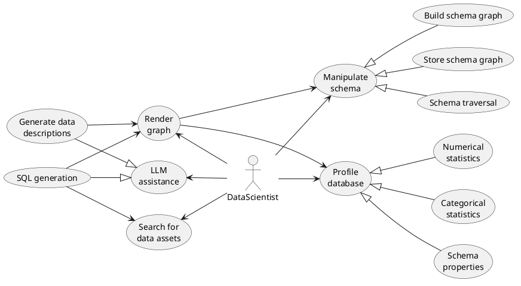
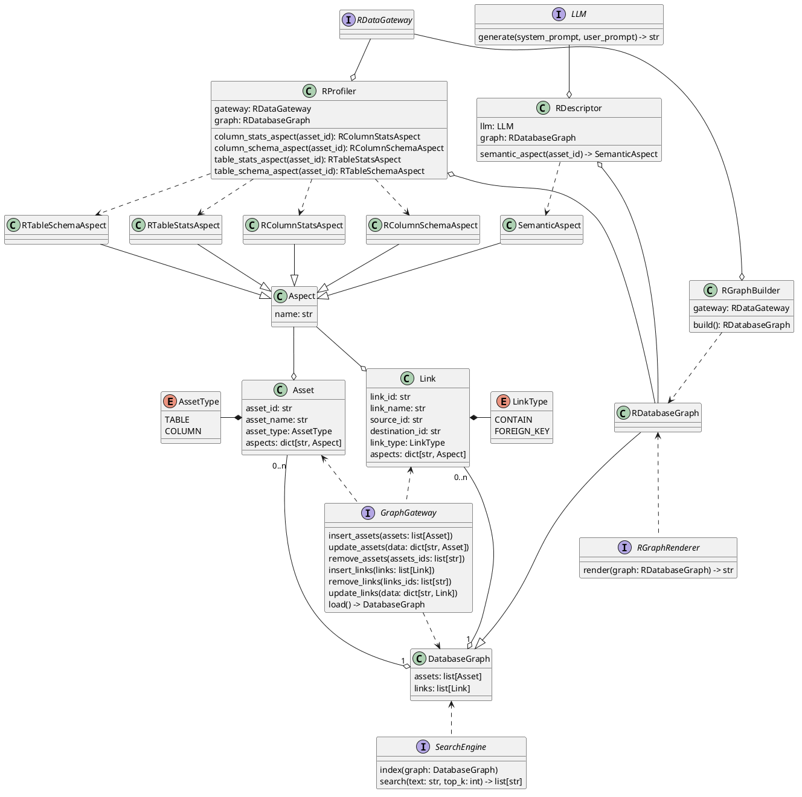

# DBGraph - Building schema graph with LLM Assistance

**DBGraph** aims to help data scientist with exploring and finding relevant data assets in a huge and complex database.

## Quick Start

Here is a quick example of how to build and query a schema graph with DBGraph:

```python
# imports
from dbgraph.builder.sqlite.sqlite_graph_builder import SQLiteGraphBuilder
from dbgraph.io.json_graph_writer import JSONGraphWriter
from dbgraph.io.json_graph_loader import JSONGraphLoader
from dbgraph.search.bm25_search_engine import BM25SearchEngine

# initiate GraphBuilder on an SQLite database
graph_builder = SQLiteGraphBuilder(Path("data/northwind.db"))

# build the schema graph (include profiling databases)
graph = graph_builder.build_graph()

# generate descriptions for assets
graph_descriptor = GraphDescriptorV1(
    llm=OAICompatibleLLM(
        model=...,
        base_url=...,
        api_key=...,
    ),
    system_prompt=...,
    formating_prompt=...,
    target_prompt=...
)
graph = graph_descriptor.rfill_semantic_aspects(graph)

# save the graph
graph_writer = JSONGraphWriter(
    json_path=Path("data/northwind-graph.json"), indent=2
)
graph_writer.write()

# load the graph
graph_loader = JSONGraphLoader(json_path=Path("data/northwind-graph.json"))
graph = self.graph_loader.load()

# index the graph using BM25
search_engine = BM25SearchEngine(Path("data/northwind-index"))
semantic_aspects = {
    a.asset_id: cast(SemanticAspect, a.aspects["semantic_properties"])
    for a in graph.assets
}
search_engine.index(semantic_aspects)

# retrieve assets using BM25
assets_ids = search_engine.search(
    "Give me the total count of orders in each categories"
)
```

## Usecases


There are 4 main groups of usecases where DBGraph is applicable:

- **Manipulating database schema**: Build the schema graph, store it, and use it to traverse around the database, find JOIN path, get references tables, ...
- **Profiling database**: Use the concept of `Aspect` to represent different types of properties attached to a single data asset.
  Each data asset can have a statistics aspects, semantical aspects, ...
- **Render graph**: Output schema graph to Markdown or text as context for LLM
- **LLM Assistance**: Leverage LLM to generate data assets' descriptions and tags. Furthermore, LLM could also be used in the process of SQL generation.
- **Search for data assets**: Search for wanted data assets based on their descriptions. The descriptions are indexed and retrieved with BM25 algorithms.

## Architecture



To encourage open-ness and extension, DBGraph is designed in a way that is very easy to extend.

1. **The core classes** (_entities_) define the shared business logic of database graphs (traversal, neighborhoods, ...) and core operations
   within the application (building graphs, profiling databases, ...). The prefix _"R..."_ stands for _"Relational"_, as the class is dedicated
   Relational databases only. The same stands for _"D.."_ (Document), _"V..."_ (Vector), _"G..."_ (Graph). However, at this point, the only supported
   paradigm is Relational database.
2. **The interfaces** (_extensions_) define a part of the system that should be **pluggable**. For example:

   - `RProfiler` and `RGraphBuilder` should works on multiple types of RDBMS, not just SQLite. Hence the abstraction of `RDataGateway`.
   - We want to support multiple LLM providers. Hence the abstraction of `LLM`.
   - There are many ways to render a graph into Markdown or text. Hence the abstraction of `RGraphRenderer`.
   - To store and load the graph's data from some storages, we have multiple options. Hence the abstraction of `GraphGateway`.
   - To index and retrieve graph's data from some search engines, we also have multiple options. Hence the abstraction of `SearchEngine`
